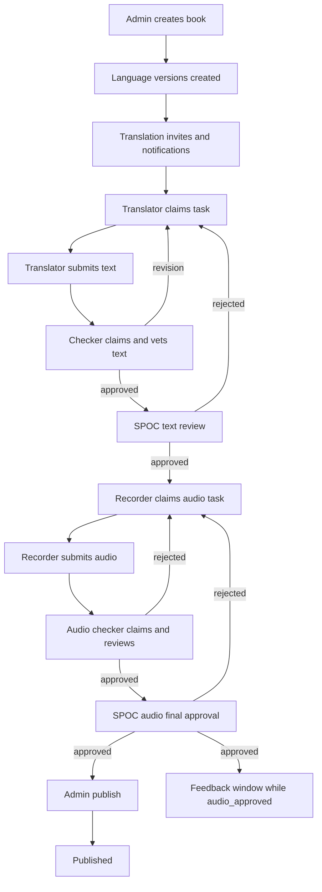
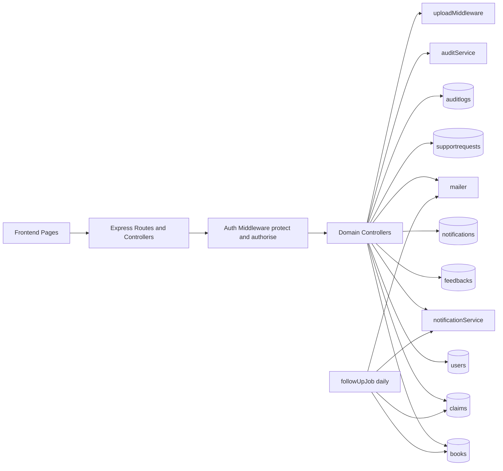

# Shantikunj Backend Flow Documentation

## 1) Purpose

This document explains how the backend works end to end:

- API endpoint map
- Role-based workflow flow
- Database data flow
- Page-level usage mapping (frontend-facing behavior inferred from backend routes)
- State transitions and how many major flows exist

## 2) System Snapshot

- Framework: Express.js
- Database: MongoDB (Mongoose)
- Auth: JWT + optional Google OAuth
- File Uploads: Multer (`uploads/translations`, `uploads/audio`)
- Scheduler: daily follow-up job at `0 9 * * *`
- Base API prefix: `/api`

Core modules:

- Auth and user lifecycle
- Admin approvals and user management
- Book workflow (translation -> checking -> SPOC -> audio -> publish)
- Claims (lock/assign model)
- Feedback
- Notifications
- Support requests
- Audit logs

## 3) Roles and Responsibilities

- `admin`: user approvals, book creation, final publish, global management
- `spoc`: language owner review, blocker control, support management
- `translator`: claim translation, submit text
- `checker`: claim checking, approve/reject text to translator
- `recorder`: claim audio generation, submit audio files
- `audio_checker`: claim audio checking, approve/reject audio to recorder
- `regional_team`: post-approval feedback participation

## 4) How Many Flows Exist?

There are **13 primary backend flows**:

1. Registration + login flow
2. Google OAuth flow
3. Admin approval/rejection flow
4. Book creation + initial translation invite flow
5. Translation claim + submission flow
6. Checking claim + checker decision flow
7. SPOC text decision flow
8. Audio claim + recorder submission flow
9. Audio checking claim + checker decision flow
10. SPOC audio final decision flow
11. Publish flow
12. Feedback window flow
13. Support + notification + audit + scheduled follow-up flow

## 5) Main Workflow (Content Production)

## 6) API and Data Flow (Request -> DB)

## 7) Page-Level Explanation (Frontend Mapping from Backend)

These page names are inferred from route intent.

### 7.1 Auth Pages

- Register page -> `POST /api/auth/register`
- Login page -> `POST /api/auth/login`
- Profile bootstrap -> `GET /api/auth/me`
- Forgot/reset password -> `POST /api/auth/forgot-password`, `POST /api/auth/reset-password/:token`
- Google sign-in -> `GET /api/auth/google`, callback `GET /api/auth/google/callback`

### 7.2 Admin Console Pages

- Pending approvals -> `GET /api/admin/users/pending`
- Approve/reject users -> `PUT /api/admin/users/:userId/approve`, `PUT /api/admin/users/:userId/reject`
- User list/delete -> `GET /api/admin/users/all`, `DELETE /api/admin/users/:userId`
- Create book -> `POST /api/books`
- Publish language version -> `PUT /api/books/:bookId/versions/:versionId/publish`

### 7.3 Work Queue and My Tasks Pages

- Available tasks for claim -> `GET /api/claims/available`
- Claim selected task -> `POST /api/claims/books/:bookId/claim`
- My active claim -> `GET /api/claims/my-claim`
- My claim history -> `GET /api/claims/my-history`
- My assigned books -> `GET /api/books/my-assignments`

### 7.4 Translation and Text Review Pages

- Upload translation docs -> `POST /api/books/upload-translation-doc`
- Submit translation -> `POST /api/books/:bookId/versions/:versionId/submit-translation`
- Checker submit decision -> `POST /api/books/:bookId/versions/:versionId/submit-vetted-text`
- SPOC text decision -> `PUT /api/books/:bookId/versions/:versionId/spoc-review`

### 7.5 Audio Pipeline Pages

- Upload audio files -> `POST /api/books/upload-audio-file`
- Submit audio -> `POST /api/books/:bookId/versions/:versionId/submit-audio`
- Audio checker decision -> `POST /api/books/:bookId/versions/:versionId/submit-audio-review`
- SPOC audio final decision -> `PUT /api/books/:bookId/versions/:versionId/spoc-audio-approval`

### 7.6 Feedback, Notification, and Support Pages

- Submit feedback -> `POST /api/feedback/books/:bookId/versions/:versionId`
- View feedback list/summary -> `GET /api/feedback/books/:bookId/versions/:versionId`, `GET /api/feedback/books/:bookId/versions/:versionId/summary`
- Notifications inbox -> `GET /api/notifications/my`
- Mark read/read-all -> `PUT /api/notifications/:notificationId/read`, `PUT /api/notifications/read-all`
- Support create/list/update -> `POST /api/support`, `GET /api/support/my`, `GET /api/support`, `PUT /api/support/:requestId/status`
- Audit log page -> `GET /api/audit`

## 8) Endpoint Catalog by Module

### 8.1 Auth (`/api/auth`)

- `POST /register`
- `POST /login`
- `GET /me`
- `GET /language-members`
- `GET /verify-email/:token`
- `POST /forgot-password`
- `POST /reset-password/:token`
- `GET /google`
- `GET /google/callback`

### 8.2 Admin (`/api/admin`)

- `GET /users/pending`
- `GET /users/all`
- `PUT /users/:userId/approve`
- `PUT /users/:userId/reject`
- `DELETE /users/:userId`

### 8.3 Books (`/api/books`)

- `POST /` (admin)
- `GET /`
- `GET /my-assignments`
- `GET /:bookId`
- `PUT /:bookId/versions/:versionId/assign`
- `PUT /:bookId/versions/:versionId/reassign`
- `PUT /:bookId/versions/:versionId/blocker`
- `PUT /:bookId/versions/:versionId/publish`
- `PUT /:bookId/versions/:versionId/text-status`
- `PUT /:bookId/versions/:versionId/audio-status`
- `POST /upload-translation-doc`
- `POST /upload-audio-file`
- `POST /:bookId/versions/:versionId/submit-translation`
- `POST /:bookId/versions/:versionId/submit-vetted-text`
- `PUT /:bookId/versions/:versionId/spoc-review`
- `POST /:bookId/versions/:versionId/submit-audio`
- `POST /:bookId/versions/:versionId/submit-audio-review`
- `PUT /:bookId/versions/:versionId/spoc-audio-approval`

### 8.4 Claims (`/api/claims`)

- `POST /books/:bookId/send-interest`
- `POST /books/:bookId/claim`
- `GET /available`
- `GET /my-claim`
- `GET /my-history`

### 8.5 Feedback (`/api/feedback`)

- `POST /books/:bookId/versions/:versionId`
- `GET /books/:bookId/versions/:versionId`
- `GET /books/:bookId/versions/:versionId/summary`

### 8.6 Notifications (`/api/notifications`)

- `GET /my`
- `PUT /:notificationId/read`
- `PUT /read-all`
- `DELETE /:notificationId`
- `DELETE /cleanup/old`

### 8.7 Support (`/api/support`)

- `POST /`
- `GET /my`
- `GET /`
- `PUT /:requestId/status`

### 8.8 Audit (`/api/audit`)

- `GET /`

## 9) Database Schema and Data Ownership

### 9.1 users

Stores identity, role, language, approval state, auth mode, reset token fields.

### 9.2 books

Stores book master plus `languageVersions[]` subdocuments. This is the workflow core and state machine container.

### 9.3 claims

One claim per active user task. Enforces lock/deadline model and tracks claim lifecycle (`active`, `submitted`, `expired`, `released`).

### 9.4 feedbacks

Final reviewer feedback per (book, version, reviewer). Unique index prevents duplicate submissions from same reviewer.

### 9.5 notifications

In-app user notifications for tasks, feedback, support, and system events.

### 9.6 supportrequests

User-raised support and callback tickets with manager assignment and status.

### 9.7 auditlogs

Immutable event timeline for key actions and transitions.

## 10) State Machines

### 10.1 Text track (inside `books.languageVersions[]`)

- `not_started`
- `translation_in_progress`
- `translation_submitted`
- `checking_in_progress`
- `checking_submitted`
- `text_approved`

Rejection path sends back to `translation_in_progress` with feedback and increments rejection counters.

### 10.2 Audio track (inside `books.languageVersions[]`)

- `not_started`
- `audio_generated`
- `audio_submitted`
- `audio_checking_in_progress`
- `audio_checking_submitted`
- `audio_approved`
- `published`

Rejection path sends back to `audio_generated` and increments rejection counters.

### 10.3 Stage (`currentStage`)

- `translation`
- `checking`
- `spoc_review`
- `audio_generation`
- `audio_checking`
- `final_verification`
- `published`

## 11) Detailed End-to-End Transition Narrative

### 11.1 Book bootstrap

1. Admin creates book.
2. All configured languages get a `languageVersions` entry.
3. Initial translator notifications and invite emails are sent.

### 11.2 Claim discipline

1. User sees only claimable tasks for their role and language.
2. Claim endpoint atomically locks version to prevent race conditions.
3. Claim record is created with deadline.
4. On submit, claim status becomes `submitted` and lock is released.

### 11.3 Text flow

1. Translator claims and submits text links.
2. Checker claims and either approves (to SPOC) or requests revision (back to translator).
3. SPOC approves (to audio generation) or rejects (back to translator).

### 11.4 Audio flow

1. Recorder claims and submits audio links.
2. Audio checker claims and either approves (to SPOC final) or rejects (back to recorder).
3. SPOC final decision either approves (to admin publish queue) or rejects (back to recorder).
4. Admin publishes version.

### 11.5 Feedback window around final approval

1. Audio checker approval requires `feedbackDeadline`.
2. Users with allowed roles can submit feedback only while status remains `audio_approved` and before `feedbackDeadline`.
3. Once admin sets status to `published`, feedback endpoint no longer accepts submissions for that version.

## 12) Cross-Cutting Services

- Notifications: event-driven user messaging (`notificationService`)
- Audit: action ledger for traceability (`auditService`)
- Mailer: transactional and reminder email output
- Upload middleware: file validation and storage for doc/audio assets

## 13) Scheduled Flow

The follow-up job runs daily and:

1. Finds active claims.
2. Expires overdue claims.
3. Resets version stage/lock to reopen work.
4. Notifies relevant role team for reopened tasks.
5. Sends periodic reminders every 3 days for active claims.

## 14) Practical Example (the one you asked)

Example: text pipeline with revision loops.

1. Translator claims translation.
2. Translator uploads/submits document links.
3. Checker claims and reviews.
4. If checker approves -> goes to SPOC review.
5. If checker rejects -> goes back to translator with feedback.
6. SPOC reviews checker-approved text.
7. If SPOC approves -> opens recorder flow.
8. If SPOC rejects -> goes back to translator again.

This creates two text revision loops:

- Loop A: `checker -> translator`
- Loop B: `spoc -> translator`

Audio side similarly has two loops:

- Loop C: `audio_checker -> recorder`
- Loop D: `spoc -> recorder`

## 15) Source of Truth Files

- `index.js`
- `routes/*.js`
- `controllers/*.js`
- `models/*.js`
- `services/*.js`
- `jobs/followUpJob.js`
- `middleware/authMiddleware.js`
- `middleware/uploadMiddleware.js`
